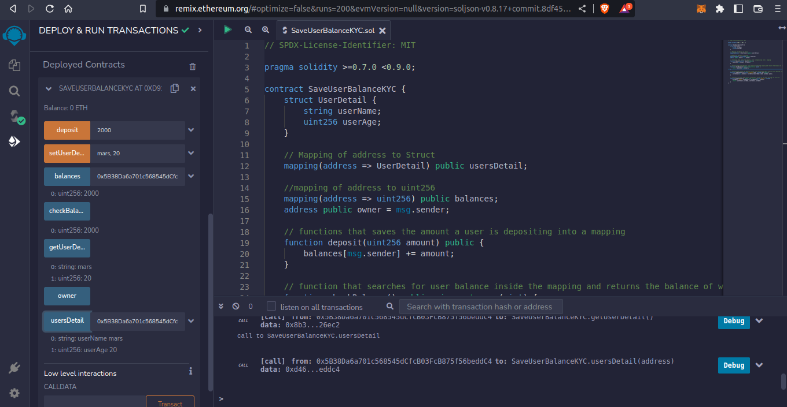
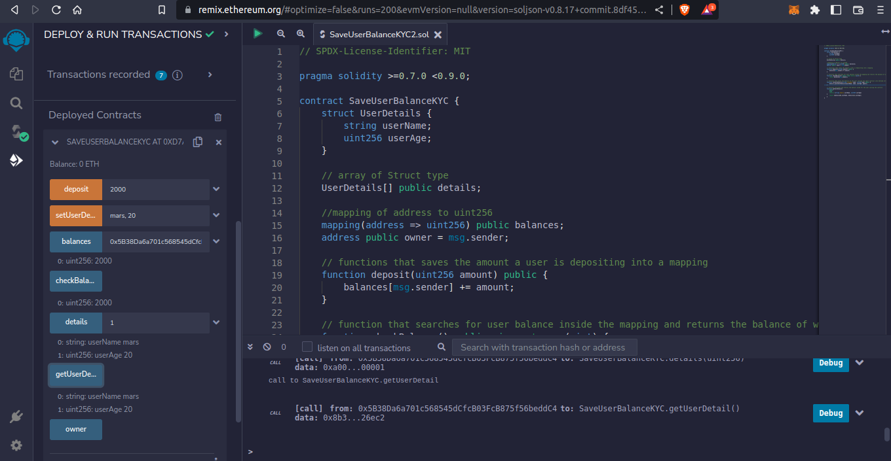

# Task - Structs

Growic Solidity Developer Program

A smart contract that saves user balance.
This contract has functions that saves the amount a user is depositing into a mapping and a function that searches for user balance inside the mapping and returns the balance of who calls the contract.
And functions allows users to save and retrieve their additional info into the smart contract as a KYC measure.

## Sample Output 1

```SaveUserBalanceKYC.sol
This uses mapping of address to Struct defined

```



## Sample Output 2

```SaveUserBalanceKYC2.sol
This uses array of Struct defined

```


